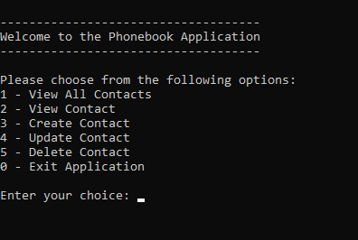
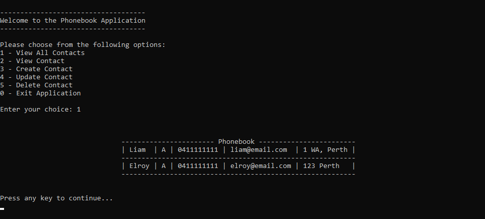
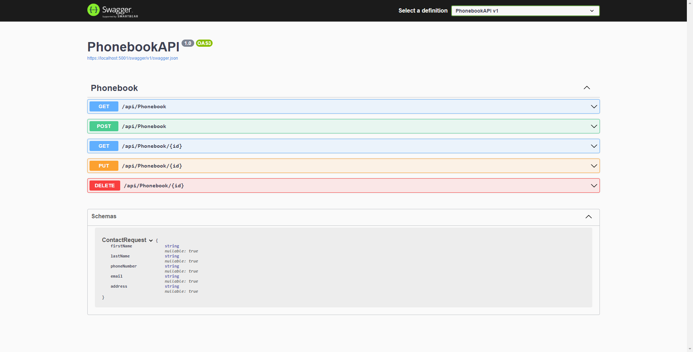
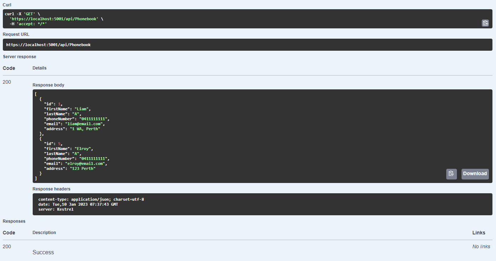

# Phonebook-WebAPI

**Phonebook CRUD Application implemented using C#.**
* Database was created using Entity Framework Core and SQL Server.
* WebAPI was tested using Swagger.

<ins>**Must run the WebAPI project first, then run the UI project.**</ins> The UI project solution checks that there is a successful WebAPI connection before advancing to the Console App menu.

**CRUD Menu Screen:**

    

**Database Sample View:**

    

**Swagger Test Sample Screen:**

    

**Example of Swagger GET Method Test:**

    

**Nuget Packages used:**

[Phonebook WebAPI]
* Microsoft Entity Framework Core
* Microsoft Entity Framework Core SqlServer
* Microsoft Entity Framework Core Tools
* Swashbuckle.AspNetCore

[Phonebook UI]
* Newtonsoft.Json
* RestSharp
* ConsoleTableExt
